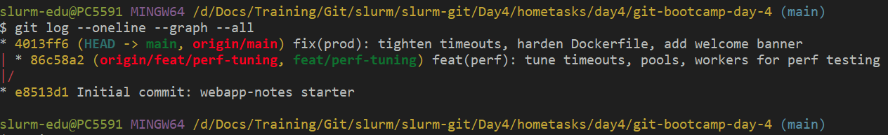
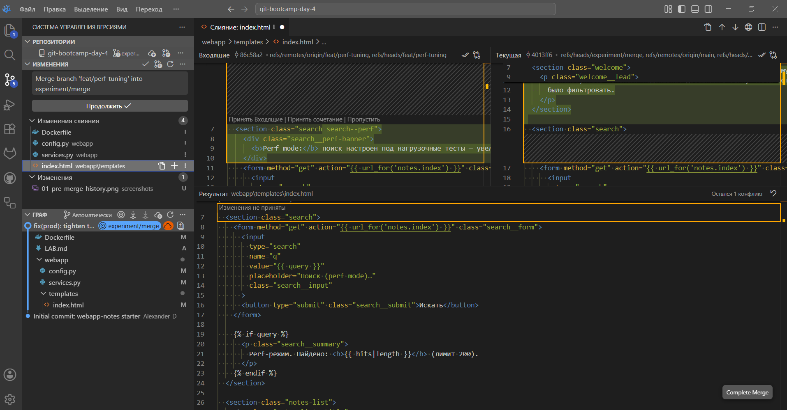
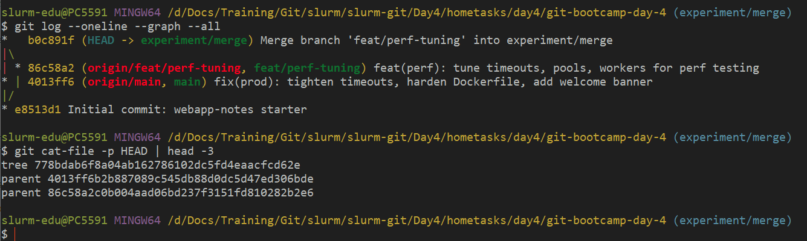
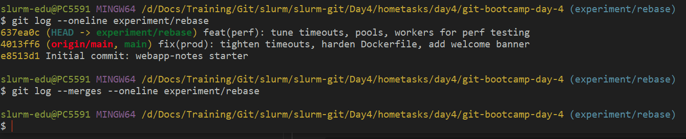
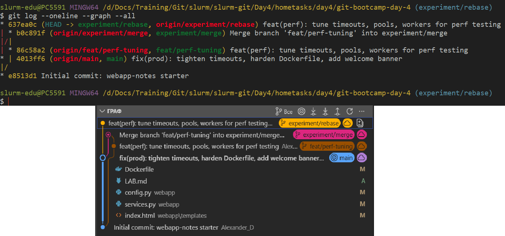
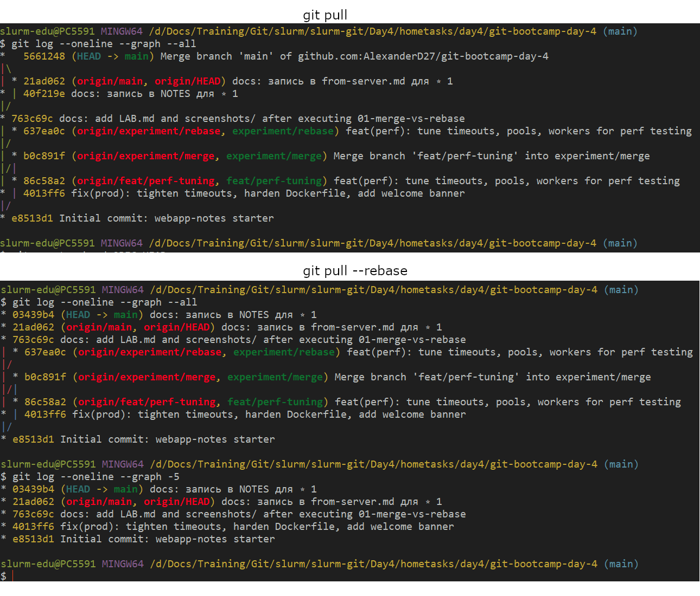

# LAB — день 4

> Это шаблон отчёта. Скопируйте его в `LAB.md` в корне вашего репозитория с ДЗ и заполните по ходу работы. Достаточно осмысленных заголовков, code-блоков с языком и ссылок на скриншоты.

Курс: [«Интенсив по погружению в GIT»](https://slurm.io/git-intensive)


## Базовая задача — `01-merge-vs-rebase`

### Стартовое состояние

[FIXME: Что было сделано перед началом разрешения конфликтов: ветка `feat/perf-tuning`, какие файлы изменены и зачем; встречный коммит на `main`. Кратко, своими словами.]

Были созданы репозитории на git-bootcamp-day-4 на github.com (без инициализации) и локальный (проинициализирован и добавлены необходимые файлы и первый коммит), далее к нему подключен созданный удаленный, а на удаленный были отправлены все файлы, коммит и присвоено имя `origin`. 

```bash
git init -b main
git add .
git commit -m "Initial commit: webapp-notes starter"
git remote add origin git@github.com:AlexanderD27/git-bootcamp-day-4.git
git push -u origin main
```

Далее создана ветка `feat/perf-tuning`, в ней в следующие файлы были внесены изменения:
- webapp/config.py — подняты лимиты (секция PerformanceSection);
- webapp/services.py — изменено search_notes под нагрузочные тесты;
- webapp/templates/index.html — заменен блок поиска;
- Dockerfile — изменена строка CMD.

Сделан коммит. Файлы отпрвлены на удаленной репозиторий.
```bash
git add webapp/config.py webapp/services.py webapp/templates/index.html Dockerfile
git commit -m "feat(perf): tune timeouts, pools, workers for perf testing"
git push -u origin feat/perf-tuning
```
Далее создана ветка feat/perf-tuning для того чтобюы изменить dockerFile, infex.html, config.py и services.py в них проивзедены настройки для нагрузочного тестирования. Далее вернулись в main и внесли изменения тимлида для подготовки в прод, тех же файлов.

Затем переключился на ветку main и выполнил работу Тимлида: внес изменения в теже файлы, hardening для продакшена — наоборот, понизил таймауты и лимиты до консервативных, добавил welcome-баннер на главной, ужесточил настройку безопасности в Dockerfile (запуск под non-root, явные таймауты gunicorn под short response).

```bash
git add webapp/config.py webapp/services.py webapp/templates/index.html Dockerfile
git commit -m "fix(prod): tighten timeouts, harden Dockerfile, add welcome banner"
git push origin main
```

Результат на скрине ниже:

```bash
# git log --oneline --graph --all (на момент окончания подготовки)
```



### Путь A — через `merge`

Перед созданием ветки `experiment/merge`, находился в ветке `main`, Во всех файлах (webapp/config.py, webapp/services.py, webapp/templates/index.html, Dockerfile) конфликты разрешал через VS Codium Merge Editor. Выбрал компромиссы из ветки main которую редактировал Тимлид, т.к. нет опыта в программировании. Создан merge коммит. Ветка загружена на удаленный репозиторий.


```bash
git switch -c experiment/merge
git merge feat/perf-tuning
git add webapp/config.py webapp/services.py webapp/templates/index.html Dockerfile
git status
git commit
git log --oneline --graph --all
git cat-file -p HEAD | head -3 
git push -u origin experiment/merge
```





### Путь B — через `rebase`

Перед созданием ветки `experiment/rebase`, перключился на предыдующую ветку. К сожалению не понял правильно ли создал в нужной ли точке (по заданию: Создать ветку experiment/rebase от того же стартового состояния, что и experiment/merge (важно: не от текущего main после merge, а от исходной точки расхождения). Удалил ее и выполнил шаг по SOLUTION.md

```bash
git checkout -
git switch -c experiment/rebase
git log --oneline --graph --all
```
Создал ветку `experiment/rebase`. Во всех файлах (webapp/config.py, webapp/services.py, webapp/templates/index.html, Dockerfile) конфликты разрешал через VS Codium Merge Editor. Выбрал компромиссы из ветки main которую редактировал Тимлид, т.к. нет опыта в программировании. В данном случае `rebase` были слияние ветки `feat/perf-tuning` в `main`, при этом коммит ветки `feat/perf-tuning` feat(perf): tune timeouts, pools, workers for perf testing был перенесен в ветку main с новым hash. 

```bash
git switch main
git switch -c experiment/rebase feat/perf-tuning
git log --oneline --graph --all
git rebase main
grep -rnE "<<<<<<<|=======|>>>>>>>" webapp/ Dockerfile
grep -rnE "<<<<<<<|=======|>>>>>>>" webapp/services.py
grep -rnE "<<<<<<<|=======|>>>>>>>" webapp/config.py
grep -rnE "<<<<<<<|=======|>>>>>>>" webapp/templates/index.html
git add webapp/config.py webapp/services.py webapp/templates/index.html Dockerfile
git rebase --continue

git log --oneline experiment/rebase
git log --merges --oneline experiment/rebase
git push -u origin experiment/rebase
```



### Сравнение

Финальная история всех веток рядом:



Что я заметил(а) в процессе сравнения (например):

- размер истории коммитов при merge весь остается, что лучше когда в команде работают, а при rebase не создавался merge коммит (собственно очистка истории от не актуальных коммитов);
- наличие merge-коммита — в ветке experiment/merge и у коммита уже два родителя, при rebase содержимое коммитов остается, но hash и "родители" другие.
- хеши коммитов фичи — после rebase различаются.
- видна ли в истории ветка как сущность — видна.

### Какой подход я бы выбрал(а) в команде и почему

Свободный, например: для слияния готовой фичи в общий `main` через PR — `merge` (или `merge --no-ff`); для обновления **своей** приватной ветки от свежего `main` перед PR — `rebase`, чтобы актуализикровать историю коммитов. Подкрепите свой выбор тем, что увидели в этом задании.

## Задания со звездочкой (опционально)
> это заполняете только если делали. иначе не включайте в отчет и удалите их шаблона

### ⭐1 — `git pull` vs `git pull --rebase`

В локальном репозитории создан файл `NODE.md` и закоммитил, затем через web github.com добавил файли `from-server.md` и закоммитил. Выполнил оба этапа и `git pull` по умолчанию и `git pull --rebase`. В `~/gitconfig` выстаивл true pull.rebase, так как более чистый результат. В первом варианте можно самому исправить дефолтное Merge branch.



### ⭐2 — `--force-with-lease` vs `--force`

Что было сделано (`git commit --amend` после push), почему обычный `git push` отказал, чем `--force-with-lease` безопаснее `--force`.


### ⭐3 — rebase с конфликтом на каждом коммите

Сюжет, через сколько `--continue` прошли, что почувствовали по сравнению с пассивным merge.


### ⭐4 — безопасный выход из detached HEAD

Как зашли в detached HEAD, какой коммит сделали, как выходили через `git switch -c`, чем `git reflog` помог как страховка.


